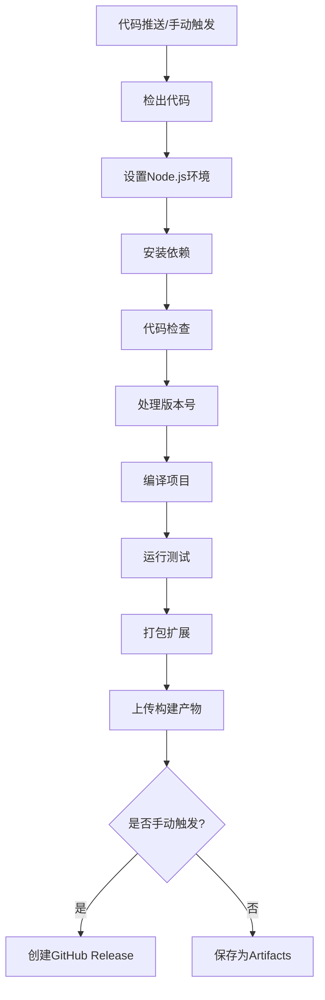

# GitHub Actions 使用说明

本项目配置了两个主要的GitHub Actions工作流，用于自动化构建和发布VS Code扩展。

## 📋 工作流概览

### 1. 构建和发布工作流 (`build-and-release.yml`)

**触发条件:**
- 🔧 **手动触发** (workflow_dispatch): 支持版本号更新和创建Release
- 🤖 **自动触发** (push): 推送到main/master分支时自动构建
- 🔍 **PR触发** (pull_request): Pull Request时进行构建检查

### 2. PR质量检查工作流 (`pr-check.yml`)

**触发条件:**
- 📝 Pull Request创建、同步或重新打开时

## 🚀 使用方法

### 手动发布新版本

1. 进入GitHub仓库的 **Actions** 标签页
2. 选择 **"Build and Release VS Code Extension"** 工作流
3. 点击 **"Run workflow"** 按钮
4. 填写参数：
   - **新版本号**: 例如 `0.0.3`, `0.1.0`, `1.0.0-beta.1`
   - **发布类型**: 选择 `release`, `prerelease`, 或 `draft`
   - **是否创建GitHub Release**: 选择 `true` 或 `false`

### 自动构建

当您推送代码到 `main` 或 `master` 分支时：
- ✅ 自动触发构建流程
- 📦 生成带构建号的VSIX文件 (如: `0.0.2+build.123`)
- 🔄 不更新package.json中的版本号
- 📁 将构建产物上传为GitHub Artifacts

### Pull Request检查

当您创建或更新Pull Request时：
- 🔍 自动进行代码质量检查
- ✨ 运行代码检查 (eslint)
- 🏗️ 验证编译和构建是否成功
- 📊 在PR中显示检查结果

## 📦 构建产物

### 手动发布
- 📄 更新 `package.json` 中的版本号
- 📋 创建GitHub Release (可选)
- 📎 Release中包含VSIX安装文件
- 🏷️ 自动生成Git标签

### 自动构建
- 📦 生成带构建号的VSIX文件
- 💾 保存为GitHub Artifacts (保留30天)
- 🔢 构建号基于GitHub运行编号

## 🔧 配置说明

### 环境变量
```yaml
NODE_VERSION: '18'  # Node.js版本
```

### 权限要求
- `GITHUB_TOKEN`: 用于创建Release和推送代码 (自动提供)

### 文件忽略
自动构建会忽略以下文件的更改：
- `**.md` - Markdown文档
- `.gitignore`
- `LICENSE`

## 📝 版本号规范

建议遵循 [语义化版本](https://semver.org/lang/zh-CN/) 规范：

- **主版本号**: 不兼容的API修改 (1.0.0 → 2.0.0)
- **次版本号**: 向下兼容的功能性新增 (1.0.0 → 1.1.0)
- **修订号**: 向下兼容的问题修正 (1.0.0 → 1.0.1)
- **预发布版本**: 1.0.0-alpha.1, 1.0.0-beta.1, 1.0.0-rc.1

## 🎯 构建流程



## 🔍 故障排除

### 常见问题

1. **构建失败 - 版本号格式错误**
   - 确保版本号符合语义化版本规范
   - 例如: `1.0.0`, `0.1.0-beta.1`

2. **权限错误**
   - 确保仓库的Actions权限已启用
   - 检查GITHUB_TOKEN权限设置

3. **依赖安装失败**
   - 检查 `package.json` 中的依赖是否正确
   - 确保Node.js版本兼容

4. **VSIX打包失败**
   - 检查 `package.json` 配置是否完整
   - 确保所有必需文件都存在

### 调试建议

- 查看Actions运行日志获取详细错误信息
- 检查 `package.json` 中的脚本命令
- 确保所有必需的文件和目录存在
- 验证语法文件和配置文件的格式

## 📚 相关资源

- [VS Code扩展开发文档](https://code.visualstudio.com/api)
- [vsce CLI工具文档](https://code.visualstudio.com/api/working-with-extensions/publishing-extension)
- [GitHub Actions文档](https://docs.github.com/cn/actions)
- [语义化版本规范](https://semver.org/lang/zh-CN/)
