# GROMACS Helper for VS Code

[](https://marketplace.visualstudio.com/items?itemName=mcardzh.gromacs-helper-vscode)
[](https://marketplace.visualstudio.com/items?itemName=mcardzh.gromacs-helper-vscode)
[](https://marketplace.visualstudio.com/items?itemName=mcardzh.gromacs-helper-vscode)
[](https://github.com/mcardzh/gromacs-helper-vscode/actions)
[](https://github.com/mcardzh/gromacs-helper-vscode/blob/main/LICENSE)

A comprehensive VS Code extension providing full support for GROMACS molecular dynamics simulation files. Supports `.mdp`, `.top`, `.itp`, `.gro`, `.ndx`, `.pdb`, `.pka`, `.rtp`, `.atp`, `.tdb`, `.hdb`, and binary formats `.xtc`, `.trr`, `.edr`, `.tpr` with syntax highlighting, semantic coloring, intelligent completion, parameter hover hints, smart force field lookup, binary file previews, Mol* 3D trajectory visualization with playback controls, real-time GROMACS process monitoring, and much more.

> [中文文档](README_ZH.md) | [English Documentation](README.md)

---

## ✨ Key Features

### 🎨 Syntax Highlighting & Semantic Coloring
- **MDP Files** (`.mdp`) - Molecular Dynamics Parameter files with semantic coloring across different parameter categories
- **TOP / ITP Topology Files** (`.top`, `.itp`) - Topology structure and include files with section keyword highlighting, atom and bonding syntax coloring
- **Force Field Parameter & Database Files** - Full support for `.rtp` (residue topology), `.atp` (atom types), `.tdb` (terminus database), `.hdb` (hydrogen database), and `ffbonded.itp` / `ffnonbonded.itp` force field parameter files
- **STRUCTURE Files** (`.gro`, `.pdb`) - Structure coordinate files with distinct residue semantic coloring (acidic, basic, polar, nonpolar, aromatic, ions, water, etc.)
- **NDX Files** (`.ndx`) - Index group files with distinct group numbering and section folding
- **PKA Files** (`.pka`) - PROPKA pKa prediction result files with residue, predicted pKa, and interaction data highlighting
- **Packmol Files** (`.packmol`, `.inp`) - Packmol input files with syntax highlighting and structure command coloring
- **XVG Data Files** (`.xvg`) - GROMACS plotting and analysis data files with comment and keyword highlighting

### 🔍 GROMACS Binary File Preview
- **Double-Click Preview**: Open `.xtc`, `.trr`, `.edr`, and `.tpr` files directly in VS Code editor tabs without external tools
- **XTC / TRR Trajectory Info**: Instant inspection of frame count, atom count, simulation length, time steps, start/end timestamps, precision, and binary metadata. Powered by a high-performance head + tail probe algorithm (574MB XTC parsed in 35ms; 3.7GB TRR parsed in 57ms)
- **EDR Energy Analysis**: Energy term statistics (min / max / mean / std), embedded Chart.js sparkline trend graphs, expandable full-featured time-series charts with hover values, search filtering, and one-click CSV export
- **TPR Parameter Summary**: Structured simulation parameter overview (integrator, steps, dt, duration), collapsible parameter categories (Simulation, Force Field, Cutoff, PME, Temperature & Pressure Coupling, etc.), modern TPR files parsed accurately via `gmx dump`

### 🎬 Mol* 3D Trajectory Viewer & Playback Control
- **Professional 3D Molecular Rendering**: Embedded Mol* viewer renders XTC / TRR trajectories alongside GRO / PDB topology files directly inside VS Code
- **Streaming Trajectory Loading**: Efficiently load multi-GB trajectory files on demand with frame indexing, minimal memory footprint, and native SSH remote streaming support
- **Interactive Trajectory Progress Bar**: Custom Viewport playback controller featuring draggable timeline slider, precision frame number input, step buttons, and live frame indicators
- **Multi-Panel & State Persistence**: Open multiple viewers simultaneously, each maintaining state across VS Code restarts

### 🧬 TOP/ITP & Force Field Intelligent Support
- **Smart Force Field Resolution**: Automatically discovers referenced force fields from `#include "xxx.ff/forcefield.itp"` across workspace relative paths and system GROMACS directories (located via `gmx -version`)
- **Atom Index Hover Cards**: Hover over any atom index in `[ bonds ]`, `[ angles ]`, `[ dihedrals ]`, or `[ pairs ]` to view residue name, atom name, atom type, partial charge, and mass
- **Atom Type Completion & Diagnostics**: Intelligent atom type autocompletion in `[ atoms ]` column 2, real-time diagnostics for undefined atom types, and graceful fallback when GROMACS is not installed
- **TDB / HDB Enhancements**: Atom type completion in TDB `[ replace ]` and `[ add ]` sections; residue name completion, hydrogen entry count validation, and geometry type range checking (1-8) in HDB files

### 🔍 GROMACS Process Monitor
- **Status Bar Live Monitoring**: Real-time simulation status directly on the VS Code status bar
- **Local & Remote SSH Monitoring**: Automatically monitors local `gmx` processes and remote SSH cluster jobs (with automatic lightweight monitor script deployment)
- **Smart Progress Parsing**: Displays remaining mdrun countdown time, current simulation time (ns/μs), step count, and completion percentage
- **Multi-Target Rotation & Dedicated Modes**: Rotate between multiple targets (pauses on mouse hover) or pin critical jobs to dedicated status bar items

### 🎯 GROMACS Commands View
- **Sidebar Command Management**: Organized by workflow stages (Structure Preparation, Simulation, Analysis, etc.)
- **Smart Placeholders**: `{pdb|gro}` searches workspace structure files for selection; `{output.gro}` and `{basename}` prompt for quick user input
- **Dedicated Terminal Execution**: One-click execution into a dedicated "GROMACS" terminal using safe relative paths

### 📊 XVG Interactive Chart Preview
- **Sidebar Plots**: Click the chart icon (📊) in the editor title bar to preview interactive XVG line charts
- **Multi-Series & Interactivity**: Zoom, pan, hover over data points, display multiple series with distinct colors, and view real-time statistical summaries

### 📦 Packmol Modeling & 3D Preview
- **Real-Time 3D Preview**: Visualize molecular arrangements and spatial distributions in a side panel
- **Smart Formatting & Autocompletion**: Auto-align coordinates and autocomplete Packmol keywords and constraints

### 🧮 MD Professional Unit Converter
- **Tailored for MD Simulations**: Instant two-way conversion for length (nm, Å, pm...), time (fs, ps, ns...), temperature (K, °C), energy (kJ/mol, kcal/mol, eV...), area, and electric potential

---

## 🚀 Supported File Formats

| File Type | Extensions / Pattern | Description | Feature Support |
|-----------|----------------------|-------------|----------------|
| **MDP** | `.mdp` | Molecular Dynamics Parameter files | Syntax highlighting, semantic coloring, intelligent completion, hover docs, error validation, formatting, snippets |
| **Topology** | `.top`, `.itp` | Topology structure files | Syntax highlighting, symbol outline, code folding, smart force field lookup, atom index hover, atom type completion & diagnostics |
| **Force Field Parameters** | `ffbonded.itp`, `ffnonbonded.itp`, etc. | Force field bonded/nonbonded params | Syntax highlighting, atom type hover & completion, preprocessor directive filtering |
| **RTP** | `.rtp` | Residue Topology Database | Syntax highlighting, residue outline, atom type completion, residue hover hints (atom count, bonds, charge) |
| **ATP** | `.atp` | Atom Type Database | Syntax highlighting, atom type outline, mass & parameter hover hints |
| **TDB** | `.tdb` | Terminus Database | Syntax highlighting, keyword hover, atom type completion, undefined type diagnostics |
| **HDB** | `.hdb` | Hydrogen Database | Syntax highlighting, residue completion, hydrogen count & geometry validation |
| **Structure** | `.gro`, `.pdb` | Structure coordinate files | Syntax highlighting, residue semantic coloring, symbol outline, PDB REMARK missing residue & Ramachandran analysis |
| **Index** | `.ndx` | Index group files | Syntax highlighting, symbol outline, index group folding |
| **XVG Data** | `.xvg` | Plotting & analysis data | Syntax highlighting, sidebar interactive chart preview, multi-series plots, statistics |
| **PKA Results** | `.pka` | PROPKA pKa prediction files | Syntax highlighting, hover hints, symbol outline, code folding |
| **Packmol** | `.packmol`, `.inp` | Packmol input files | Syntax highlighting, 3D interactive preview, auto-formatting, autocompletion |
| **Trajectory** | `.xtc`, `.trr` | Trajectory binary files | Instant metadata preview, Mol* 3D trajectory rendering, streaming loading, interactive progress bar |
| **Energy** | `.edr` | Energy binary files | Energy term statistics (min/max/mean/std), sparkline graphs, time-series chart viewer, CSV export |
| **Run Input** | `.tpr` | Run input binary files | Structured simulation parameter view, collapsible parameter sections, version & precision metadata |

## 📦 Installation

1. Open VS Code
2. Press `Ctrl+Shift+X` to open the Extensions panel
3. Search for "GROMACS Helper"
4. Click Install

Or install directly from the [VS Code Marketplace](https://marketplace.visualstudio.com/items?itemName=mcardzh.gromacs-helper-vscode).

## 🎮 Features & Illustrated Usage Guide

### 1. MDP File Editing & Intelligent Assistance

- **Syntax Highlighting & Semantic Coloring**: MDP parameters are categorized and colored according to their simulation purpose.
- **Intelligent Autocompletion**: Auto-complete parameter names and recommended values supporting GROMACS 2025.x.
- **Hover Documentation & Live Validation**: Hover over parameters to view valid ranges, units, and descriptions; invalid values are flagged immediately.
- **Snippets & Auto-Formatting**: Expand standard simulation setups (`em`, `nvt`, `npt`, `md`) with one keypress and format parameters with clean indentation.

| MDP Syntax Highlighting & Semantic Coloring | MDP Hover Hints & Error Diagnostics |
|:---:|:---:|
| 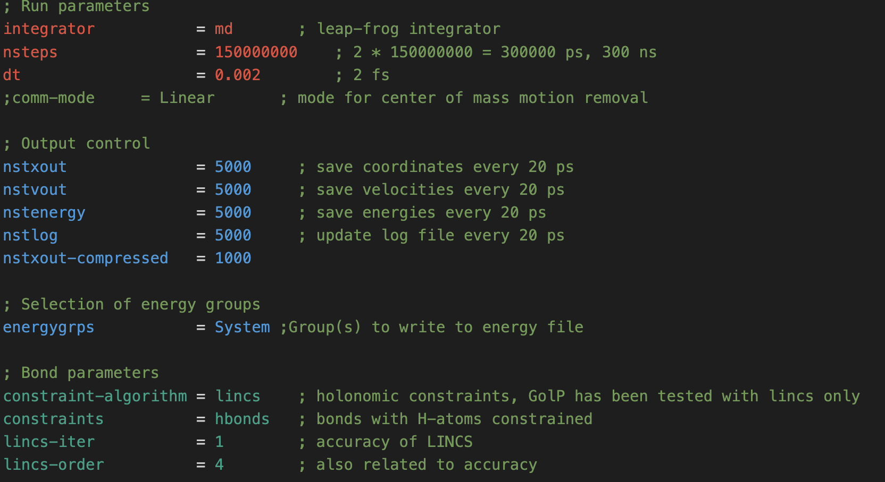 | 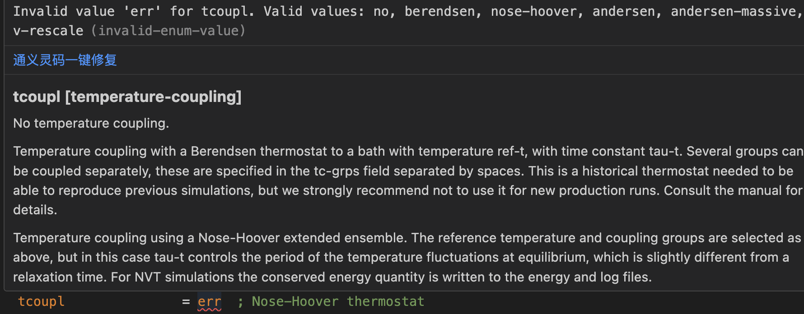 |

| MDP Intelligent Completion | MDP Simulation Snippets | MDP Auto-Formatting & Alignment |
|:---:|:---:|:---:|
| 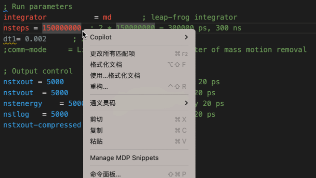 | 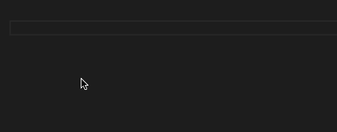 | 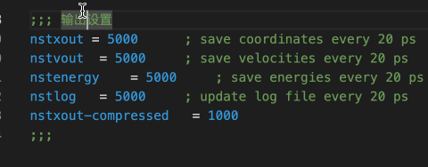 |

---

### 2. TOP / ITP Topology & Force Field Full Support

- **Smart Force Field Resolution**: Discovers force field libraries referenced in `#include` directives across workspace folders and system GROMACS paths.
- **Atom Index Hover Cards**: Hover over any atom ID in `[ bonds ]`, `[ angles ]`, `[ dihedrals ]`, etc., to inspect residue names, atom names, types, charges, and masses.
- **Document Outline**: Navigate through `defaults`, `moleculetype`, `atoms`, and other sections in the Explorer outline.
- **Force Field Parameter Support**: Full language support for `.rtp`, `.atp`, `.tdb`, `.hdb`, and `ffbonded.itp` / `ffnonbonded.itp`.

| TOP/ITP Syntax Highlighting | TOP/ITP Symbol Outline | TOP/ITP Atom Hover & Completion |
|:---:|:---:|:---:|
| 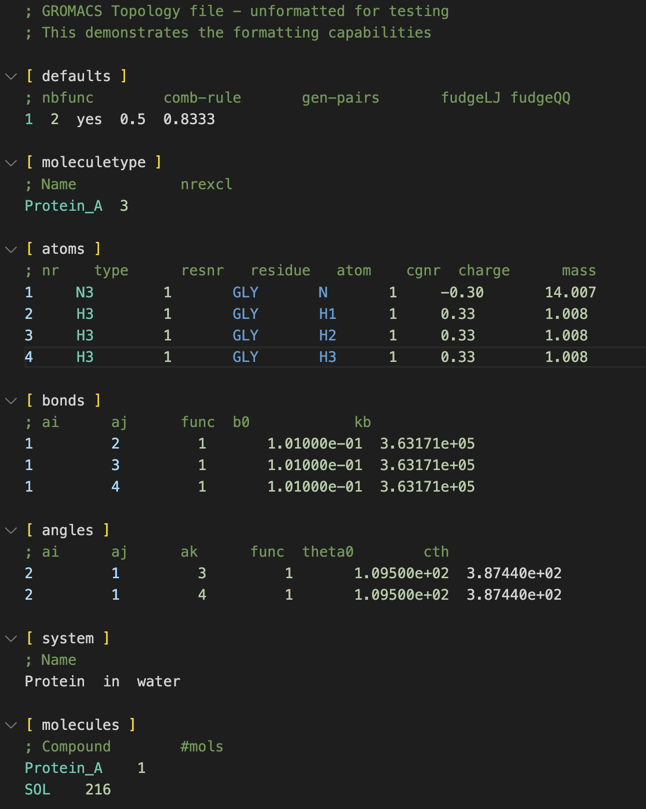 | 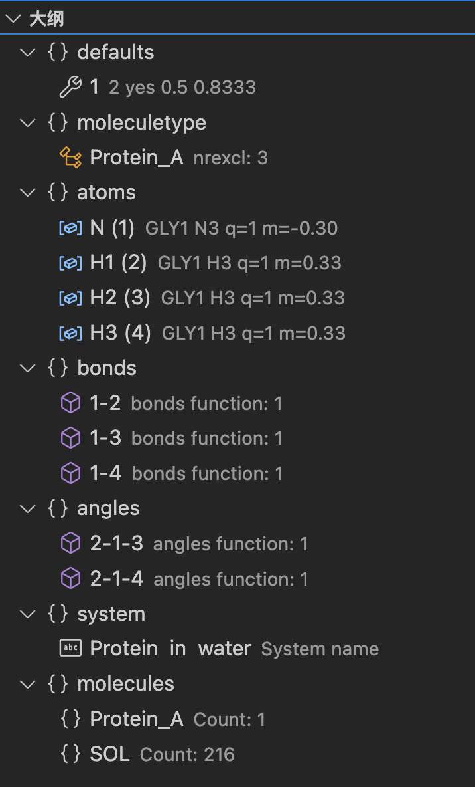 | 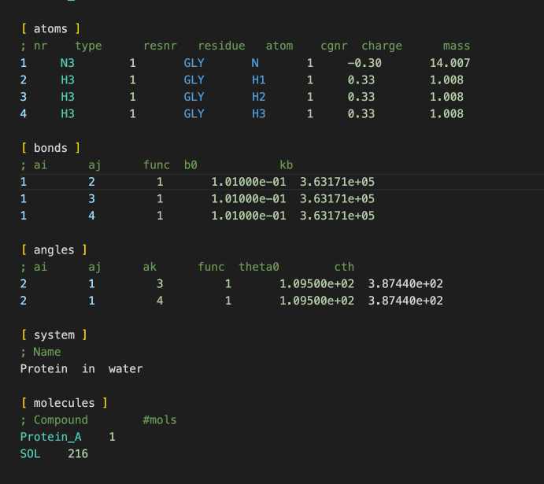 |

---

### 3. GRO / PDB Structure Files & Analysis

- **GRO Semantic Coloring**: Clear visual distinction for residue names, atom names, atom indices, and 3D coordinates.
- **PDB REMARK Deep Analysis**: Identifies and explains `REMARK 465` (missing residues), `REMARK 500` (Ramachandran outliers), and other structural metadata.
- **Secondary Structure Navigation**: Jump to specific Sheets, Strands, Chains, Residues, and HETATM records in the outline view.

| GRO Coordinate Semantic Coloring | PDB REMARK Structural Analysis | PDB Secondary Structure Outline |
|:---:|:---:|:---:|
| 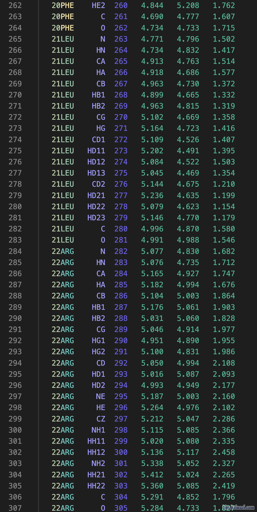 | 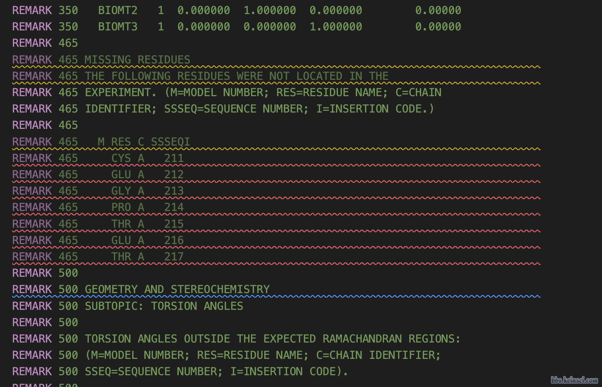 | 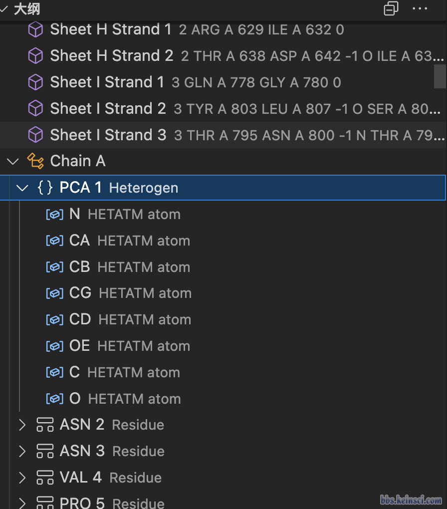 |

---

### 4. NDX Index Group Support

- Highlight index groups and enable section folding.
- Fast navigation to index groups (`System`, `Protein`, `Backbone`, `SOL`, `CL`, etc.) via the outline view.

| NDX Index Group Highlighting | NDX Symbol Outline |
|:---:|:---:|
| 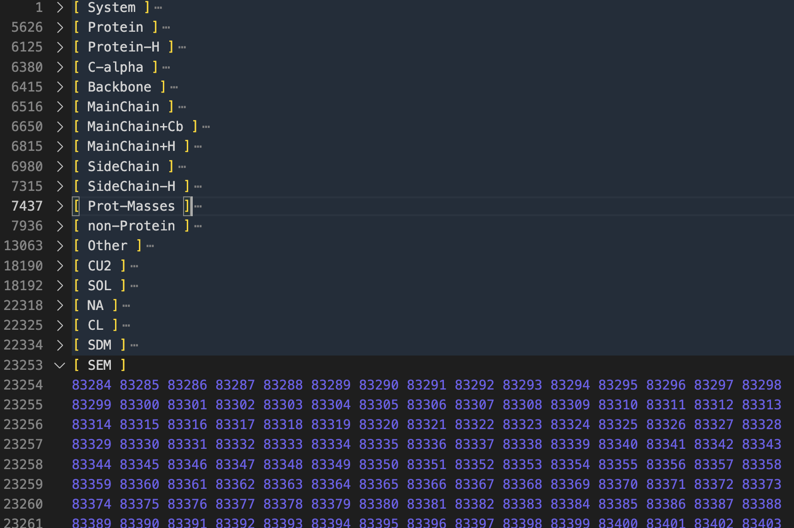 | 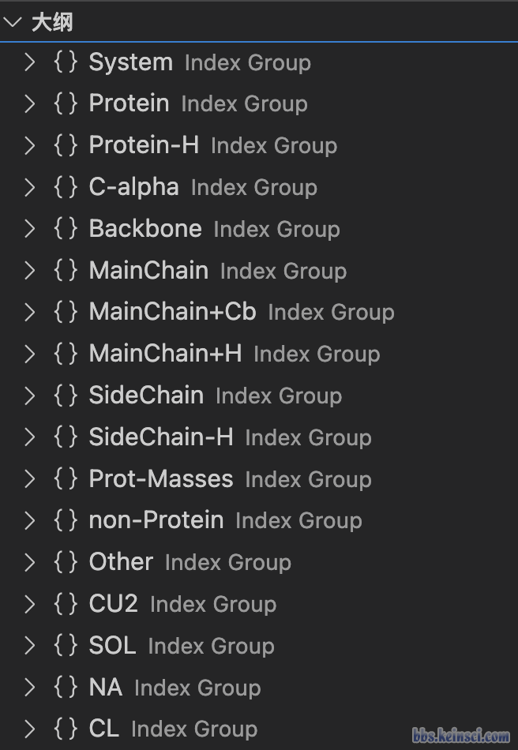 |

---

### 5. XVG Data File Interactive Plot Preview

- Click the chart icon (📊) in the editor title bar or select "Preview XVG Chart" from the context menu.
- Interactive side panel with zoom, pan, hover tooltips, multi-series support, and statistical calculations (min, max, mean).

| XVG Syntax Highlighting | XVG Interactive Side Panel Chart Preview |
|:---:|:---:|
| 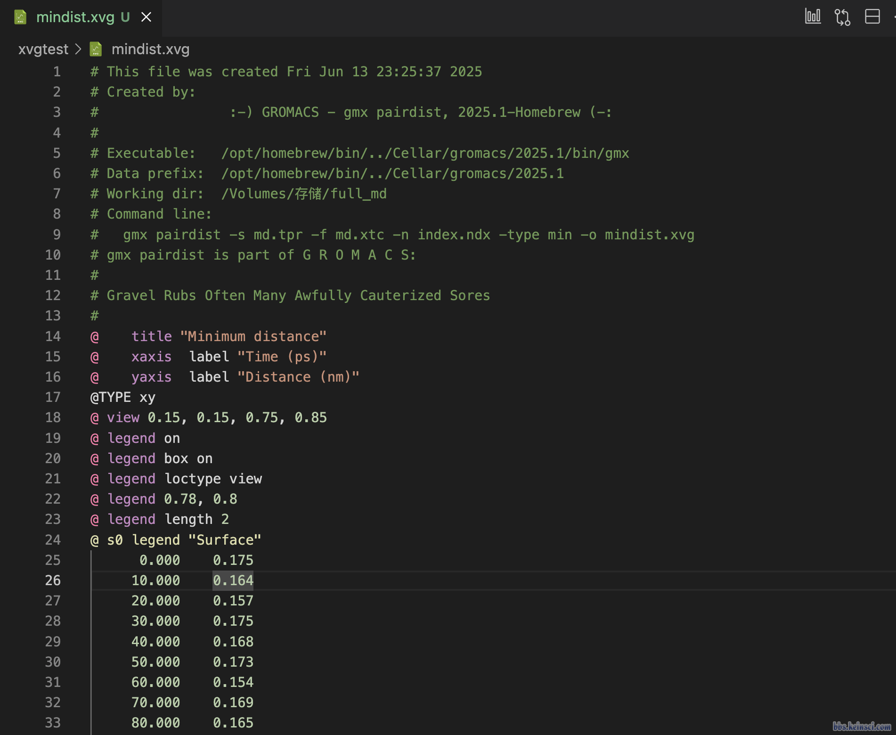 | 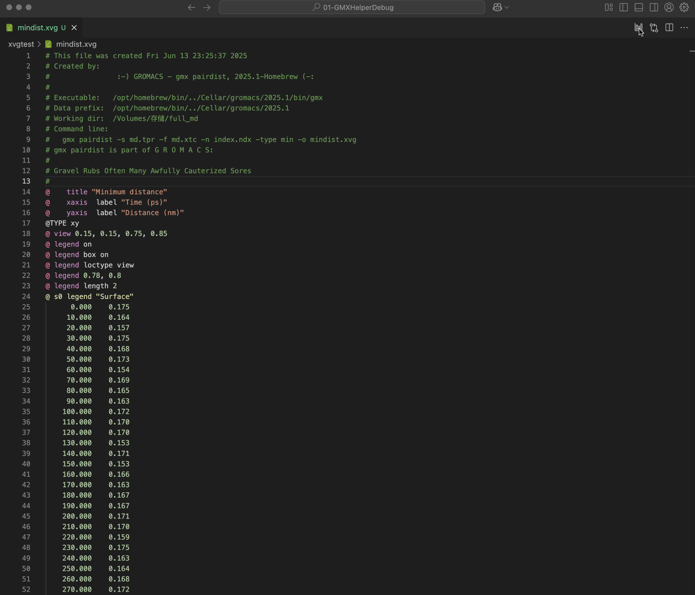 |

---

### 6. Packmol Modeling & 3D Structure Preview

- Syntax highlighting, keyword autocompletion, and formatting for `.packmol` and `.inp` files.
- Click the 3D preview button to visualize the packed molecular system in real time.

| Packmol Input Highlighting | Packmol Completion & Formatting | Packmol 3D Structure Preview |
|:---:|:---:|:---:|
| 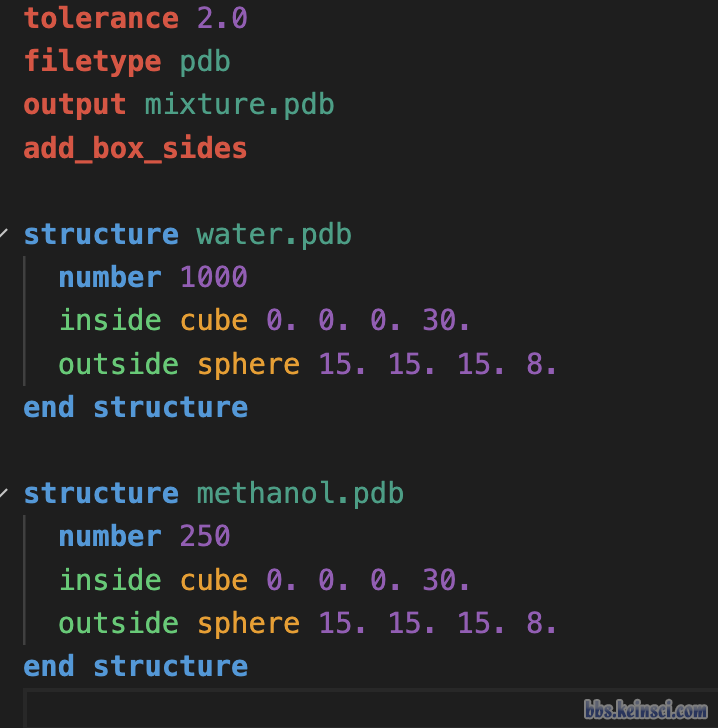 | 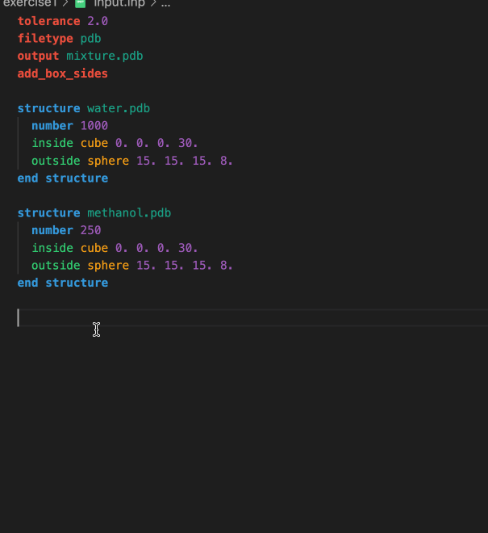 | 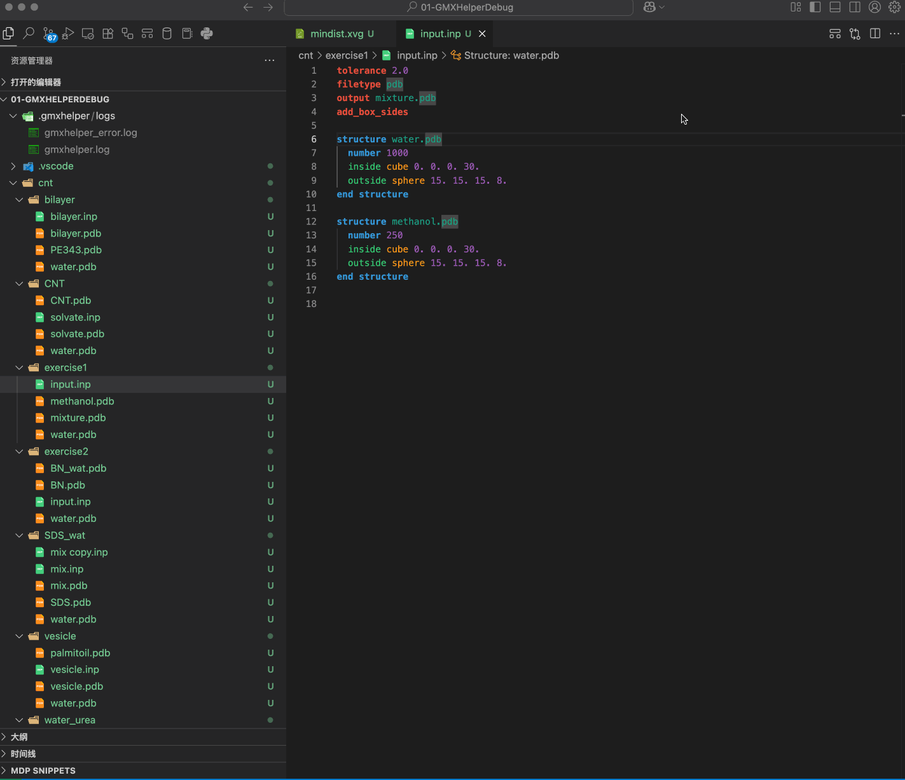 |

---

### 7. GROMACS Process Monitor

- **Live Status Bar Monitoring**: Out-of-the-box local GROMACS process tracking.
- **Remote SSH Monitoring**: Connect to remote HPC clusters to track simulation time, step counts, and remaining time countdowns.
- **Detailed Hover Card**: Hover over the status bar item to view working directories, log file paths, and execution commands.

| Process Monitor Detailed Hover Card | Status Bar Job Indicator |
|:---:|:---:|
| 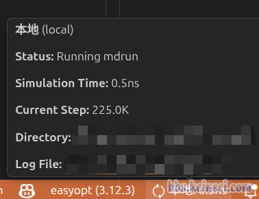 | 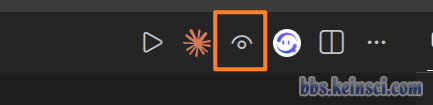 |

---

### 8. GROMACS Binary File Preview & Mol* 3D Trajectory Viewer

- **Binary File Preview**: Double-click `.xtc`, `.trr`, `.edr`, or `.tpr` files to inspect binary structure and parameter metadata.
- **Mol* 3D Trajectory Viewer**: Right-click `.xtc` or `.trr` and choose "Open with Mol* Viewer", pairing with a `.gro` / `.pdb` topology.
- **Streaming Trajectory Loading**: Automatically recommends streaming mode for large trajectory files to prevent memory spikes.
- **Interactive Timeline Controls**: Scrub through trajectory frames using the custom viewport slider, enter specific frame numbers, or use step buttons.

| Large Trajectory Streaming Prompt | Mol* 3D Viewer & Playback Controls |
|:---:|:---:|
| 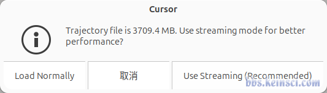 | 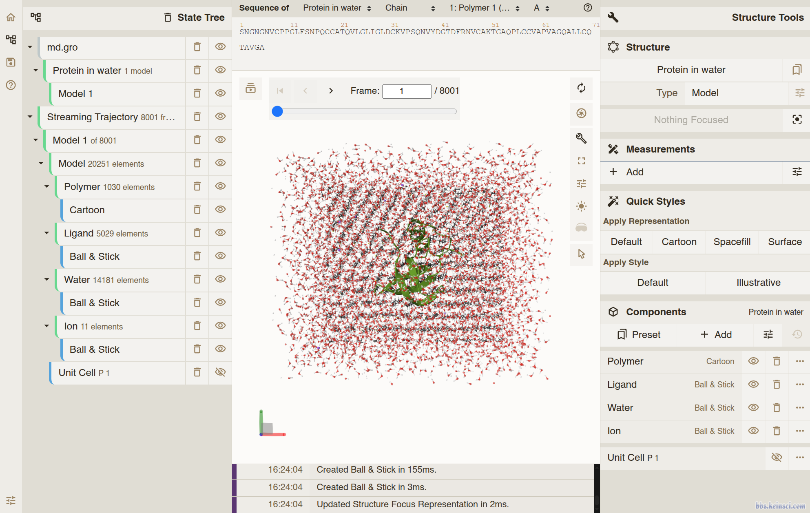 |

---

### 9. GROMACS Commands View & Unit Converter

- **GROMACS Commands View**: Open the "GROMACS Commands" container in the Activity Bar to trigger common simulation workflows with smart workspace file resolution.
- **Unit Converter**: Open the Command Palette (`Ctrl+Shift+P` / `Cmd+Shift+P`) and search for **"GROMACS Helper: Open Unit Converter"** for quick MD unit transformations.

---

## ⚙️ Configuration Options

Configure the extension behavior in your `settings.json`:

### GROMACS Process Monitor Configuration
```json
{
  "gromacsHelper.monitor.enabled": true,
  "gromacsHelper.monitor.refreshInterval": 5000,
  "gromacsHelper.monitor.rotateInterval": 10000,
  "gromacsHelper.monitor.targets": [
    {
      "id": "local-default",
      "name": "Local",
      "type": "local",
      "independent": false
    },
    {
      "id": "remote-cluster",
      "name": "HPC-Server",
      "type": "remote",
      "sshHost": "user@hpc.example.com",
      "independent": true
    }
  ]
}
```

### Trajectory Playback Performance Options
```json
{
  "gromacsHelper.trajectoryPlayback.cacheSize": 256,
  "gromacsHelper.trajectoryPlayback.prefetchDepth": 2,
  "gromacsHelper.trajectoryPlayback.maxConcurrentReads": 4
}
```

---

## 🔧 Development & Contributing

### Local Development
```bash
# Clone the repository
git clone https://github.com/mcardzh/gromacs-helper-vscode.git
cd gromacs-helper-vscode

# Install dependencies
npm install

# Compile extension
npm run compile

# Start watch mode
npm run watch
```

### Package Extension (.vsix)
```bash
npm run package
```

---

## 🗂️ Changelog

### [0.6.1] - 2026-08-27

#### 🔒 Security & Maintenance
- **Fixed Dependency Vulnerability (CVE-2026-29063)**: Upgraded `immutable` dependency to `5.1.9` to remediate prototype pollution vulnerability
- **Documentation & Visuals**: Updated bilingual README with complete illustrated guides and integrated 22 feature screenshots and animation GIFs

### [0.6.0] - 2026-08-27

#### ✨ Added
- **Full Force Field Language Support** — IDE-grade editing experience for all GROMACS force field files
  - **ITP Force Field Parameter Files**: Dedicated language support for `ffbonded.itp`, `ffnonbonded.itp`, `ffnabonded.itp`, `ffnanonbonded.itp`, syntax highlighting, atom type autocompletion, hover hints, and preprocessor directive filtering
  - **TDB Enhancements**: Atom type completion in `[ replace ]` and `[ add ]` sections, indented line recognition, and undefined atom type diagnostics
  - **HDB Enhancements**: Residue name completion, hydrogen entry count validation, geometry type (1-8), and hydrogen count (1-4) range checks
  - **TOP/ITP Full Support**:
    - **Smart Force Field Resolution**: Automatic `#include` path detection across workspace relative paths and system GROMACS installations (`gmx -version`)
    - **Atom Index Hover Cards**: Hover over atom IDs in `[ bonds ]`, `[ angles ]`, `[ dihedrals ]`, `[ pairs ]` to see residue, atom name, type, charge, and mass
    - **Atom Type Completion & Diagnostics**: Completion in `[ atoms ]` column 2, real-time undefined atom type detection with graceful fallback
    - **Section Header Hover**: Formatted explanations for `[ atoms ]`, `[ bonds ]`, `[ moleculetype ]`, and other standard directives

### [0.5.0] - 2026-08-27

#### ✨ Added
- **GROMACS Force Field Support**: Syntax highlighting, completion, hover documentation, symbol outline, and diagnostics for `.rtp`, `.atp`, `.tdb`, and `.hdb`
- **GROMACS Binary File Preview**: Double-click `.xtc`, `.trr`, `.edr`, or `.tpr` files to inspect metadata in editor tabs
  - **XTC / TRR Trajectory Preview**: Frame count, atom count, duration, dt, timestamps, precision, and binary headers
  - **EDR Energy Analysis**: Energy term statistics, Chart.js sparkline graphs, interactive time-series viewer, CSV export
  - **TPR Parameter Preview**: Structured simulation parameters, modern TPR parsed via `gmx dump`
- **Performance Optimization**: Head + tail probe parser accelerates 574MB XTC parsing from 145s to 35ms (4100x speedup)

### [0.4.1] - 2026-01-14

#### ✨ Added & Fixed
- **Trajectory Progress Bar Control**: Custom timeline slider, frame number input, step buttons, and current frame indicators
- **Playback Optimization**: Enhanced LRU cache, prefetch pipeline, and remote playback debouncing

### [0.4.0] - 2025-12-25

#### ✨ Added
- 🎬 **Mol* Trajectory Viewer**: 3D molecular visualization and streaming loading for extra-large trajectory files

### [0.3.4] - 2025-12-24

#### ✨ Added
- 🎯 **GROMACS Commands View**: Sidebar command runner with smart placeholders and dedicated terminal execution

### [0.3.0] - 2025-12-23

#### ✨ Added
- 🔍 **GROMACS Process Monitor**: Real-time local and remote SSH simulation tracking on the status bar

---

## 📄 License

This project is open-sourced under the [GPLv2](LICENSE) license.

---

**Enjoy your GROMACS development experience!** 🧬⚗️

## 📞 Support

If this extension helps you, please give us a ⭐️!

Questions or suggestions? Please contact us through:
- [GitHub Issues](https://github.com/mcardzh/gromacs-helper-vscode/issues)
- [Email](mailto:mcardzh@gmail.com)
